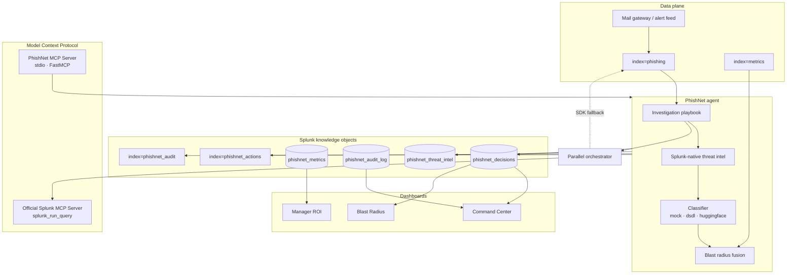

<p align="center">
  
</p>

<h1 align="center">PhishNet AI</h1>

<p align="center">
  <strong>Autonomous phishing investigation, native to Splunk.</strong><br/>
  An agentic Tier-1 SOC analyst that triages alerts, explains every decision,<br/>
  and fuses security signals with observability into a blast radius view.
</p>

<p align="center">
  <a href="LICENSE"></a>
  <a href="https://splunk.com"></a>
  <a href="https://modelcontextprotocol.io"></a>
  <a href="https://huggingface.co/fdtn-ai/Foundation-Sec-8B-Instruct"></a>
  
</p>

<p align="center">
  <a href="#overview">Overview</a> ·
  <a href="#architecture">Architecture</a> ·
  <a href="#investigation-pipeline">Pipeline</a> ·
  <a href="#mcp-integration">MCP</a> ·
  <a href="#dashboards--rbac">Dashboards</a> ·
  <a href="#installation">Installation</a> ·
  <a href="#configuration">Configuration</a>
</p>

---

## Overview

Tier-1 analysts receive hundreds of phishing alerts per shift; a thorough investigation takes 20–30 minutes each. PhishNet AI runs a fixed multi-step playbook on every alert, classifies with a security foundation model, correlates email and endpoint telemetry, and writes structured verdicts back into Splunk with a transparent reasoning chain.

| Capability | Description |
|---|---|
| **Splunk-native reputation** | Domain/URL risk from your own `index=phishing` and prior agent verdicts — no external threat-feed APIs |
| **Dual MCP** | Exposes investigation as MCP tools and optionally consumes Splunk's official MCP Server for searches |
| **Parallel orchestration** | One `investigate_alert` call fans out five independent Splunk searches concurrently |
| **Blast radius** | Email → click → credential submit → endpoint impact in one fused timeline |
| **RBAC** | Separate analyst and manager views, enforced in Splunk roles and view metadata |
| **Audit trail** | Agent decisions, analyst overrides, and remediation actions persisted to KV and index |

<p align="center">
  
</p>

---

## Architecture

PhishNet AI is a **Splunk app**. The agent runs as a modular input; dashboards read KV Store collections; the same pipeline is available over MCP to external AI clients.



### Data stores

| Object | Purpose |
|---|---|
| `index=phishing` | Inbound phishing alerts (`sourcetype=phishnet:alert`) |
| `index=metrics` | Endpoint/host telemetry for blast-radius charts |
| `index=phishnet_actions` | Agent investigation reports |
| `index=phishnet_audit` | Analyst overrides and remediation audit trail |
| `phishnet_decisions` (KV) | Per-alert verdict, reasoning, steps, blast fields — primary dashboard source |
| `phishnet_threat_intel` (KV) | Splunk-native domain/URL reputation cache |
| `phishnet_metrics` (KV) | Aggregated ROI metrics for the manager dashboard |
| `phishnet_audit_log` (KV) | Audit events mirrored for reliable Simple XML panels |

### Tech stack

| Layer | Technology |
|---|---|
| Platform | Splunk Enterprise 9.x–10.x |
| Agent | Python modular input + alert action (`splunklib`) |
| Classification | [Foundation-Sec-8B-Instruct](https://huggingface.co/fdtn-ai/Foundation-Sec-8B-Instruct) via Ollama |
| PhishNet MCP server | [FastMCP](https://github.com/modelcontextprotocol/python-sdk) |
| Splunk MCP client | [Splunk MCP Server](https://splunkbase.splunk.com/app/7931) — optional `splunk_run_query` transport |
| UI | Splunk Simple XML dashboards |

---

## Investigation pipeline

Each alert passes through a fixed playbook. Every step emits a signal (`benign` · `suspicious` · `malicious` · `neutral`) and a finding stored in `steps_text` for dashboards and reports.

```
┌─────────────────┐     ┌──────────────────┐     ┌─────────────────┐
│ sender_reputation│ ──► │ url_analysis      │ ──► │ recipient_scope │
│ splunk:reputation│     │ splunk:reputation │     │ splunk_mcp      │
└─────────────────┘     └──────────────────┘     └────────┬────────┘
                                                            │
┌─────────────────┐     ┌──────────────────┐               ▼
│ blast_radius     │ ◄── │ click_through     │ ◄─── ┌─────────────────┐
│ metrics index    │     │ proxy / creds     │     │ classifier       │
└─────────────────┘     └──────────────────┘     │ Foundation-Sec-8B│
                                                    └─────────────────┘
```

**Splunk-native reputation** derives risk from:

- Domain age and alert metadata  
- Cross-alert volume in `index=phishing`  
- Recipient reach across historical alerts  
- Prior malicious verdicts in `phishnet_decisions`

The classifier (`mock`, `dsdl`, or `huggingface`) produces the final verdict and recommended action (`close` · `escalate` · `remediate` · `review`).

---

## MCP integration

### PhishNet as MCP server

`phishnet_mcp_server.py` exposes the investigation pipeline to any MCP client over stdio:

| Tool | Description |
|---|---|
| `list_alerts` | Queue snapshot |
| `triage_queue` | Investigate all alerts; return summary and per-alert outcomes |
| `investigate_alert` | Full investigation, text report, and parallel orchestration block |
| `get_blast_radius` | Security + observability fusion for one alert |

```bash
python phishnet_ai/bin/phishnet_mcp_server.py
```

Example client configuration:

```json
{
  "mcpServers": {
    "phishnet-ai": {
      "command": "python",
      "args": ["phishnet_ai/bin/phishnet_mcp_server.py"],
      "env": {
        "PHISHNET_SPLUNK_USER": "your_user",
        "PHISHNET_SPLUNK_PW": "your_password",
        "PHISHNET_CLASSIFIER": "dsdl"
      }
    }
  }
}
```

### PhishNet as Splunk MCP client

When `PHISHNET_USE_SPLUNK_MCP=1`, the parallel orchestrator routes SPL through Splunk's official MCP Server (`splunk_run_query`) instead of direct SDK searches. Tokens are minted via `/services/mcp_token`; the SDK is used automatically as a fallback if an MCP call fails.

Parallel orchestration runs five concurrent searches per investigation:

| Tool | Data source |
|---|---|
| `sender_reputation` | `phishnet_threat_intel` KV |
| `message_trace` | `index=phishing` |
| `recipient_exposure` | `phishnet_decisions` KV |
| `user_interaction` | `phishnet_decisions` KV |
| `endpoint_blast_radius` | `phishnet_decisions` KV |

The `investigate_alert` response includes `wall_ms`, `sequential_ms`, `speedup`, and `transport` (`sdk` or `splunk_mcp`).

---

## Dashboards & RBAC

| View | Audience | Purpose |
|---|---|---|
| **Command Center** | Analyst | Queue, coverage status, reasoning drilldown, audit feed |
| **Blast Radius** | Analyst | Attack timeline, endpoint telemetry, evidence chain |
| **Manager ROI** | Manager | Throughput, hours saved, accuracy and escalation trends |

Roles are defined in `phishnet_ai/default/authorize.conf`:

| Role | Access |
|---|---|
| `phishnet_analyst` | Command Center, Blast Radius; indexes `phishing`, `phishnet_actions`, `phishnet_audit` |
| `phishnet_manager` | Analyst views plus **Manager ROI** (restricted in `metadata/default.meta`) |
| `admin` | Full access |

Splunk hides nav entries and denies direct URL access when a user lacks read permission on a view.

---

## Installation

### Prerequisites

- Splunk Enterprise 9.x–10.x  
- Python 3.10+ with `splunk-sdk` and `mcp`  
- [Splunk MCP Server](https://splunkbase.splunk.com/app/7931) (optional — required only for `PHISHNET_USE_SPLUNK_MCP`)  
- Ollama + Foundation-Sec-8B (optional — required only for `dsdl` classifier)

### Deploy the app

```powershell
git clone https://github.com/VineetLoyer/phishnet.git
cd phishnet

# Elevated PowerShell
.\scripts\deploy_to_splunk.ps1
```

Open **http://localhost:8000** → Apps → **PhishNet AI**.

### Install the official Splunk MCP Server (optional)

```powershell
& "$env:SPLUNK_HOME\bin\splunk.exe" install app path\to\splunk-mcp-server.tgz -auth user:password
```

Enable Splunk token authentication and grant `mcp_tool_execute` to the roles that will call the server.

### Python dependencies

```powershell
pip install splunk-sdk mcp
```

### Run the agent

Configure the `phishnet_agent` modular input in Splunk, or run standalone:

```powershell
$env:PHISHNET_SPLUNK_USER = "your_user"
$env:PHISHNET_SPLUNK_PW   = "your_password"

python phishnet_ai/bin/phishnet_agent.py --once --classifier mock
```

Alerts are read from `index=phishing`; results are written to `phishnet_decisions` KV and `index=phishnet_actions`.

---

## Configuration

### Modular input

| Parameter | Default | Description |
|---|---|---|
| `source_index` | `phishing` | Alert source index |
| `mode` | `recommend` | `recommend` or `auto` |
| `classifier` | `mock` | `mock` · `dsdl` · `huggingface` |
| `auto_close_confidence` | `0.90` | Auto-close threshold when `mode=auto` |

Full schema: `phishnet_ai/README/inputs.conf.spec`.

### Environment variables

| Variable | Purpose |
|---|---|
| `PHISHNET_SPLUNK_USER` / `PHISHNET_SPLUNK_PW` | Splunk REST credentials |
| `PHISHNET_SPLUNK_TOKEN` | Token-based auth alternative |
| `PHISHNET_CLASSIFIER` | Classifier for MCP server and standalone runs |
| `PHISHNET_USE_SPLUNK_MCP` | Route orchestrator searches through official Splunk MCP |
| `PHISHNET_SPLUNK_MCP_URL` | MCP endpoint override (default `https://localhost:8089/services/mcp`) |

---

## Repository layout

```
phishnet/
├── phishnet_ai/                   # Splunk app
│   ├── default/                   # conf, dashboards, RBAC, KV schemas
│   ├── bin/
│   │   ├── phishnet_agent.py      # modular input
│   │   ├── phishnet_remediate.py  # alert action
│   │   ├── phishnet_mcp_server.py # MCP server
│   │   └── phishnet_lib/          # pipeline, classifier, orchestrator, threat intel
│   └── metadata/default.meta
├── scripts/                       # deploy and data utilities
├── tests/                         # pytest smoke tests
└── LICENSE
```

Core library modules under `phishnet_ai/bin/phishnet_lib/`:

| Module | Role |
|---|---|
| `pipeline.py` | Agent run loop: ingest → investigate → classify → persist |
| `investigation.py` | Multi-step playbook |
| `classifier.py` | Foundation-Sec-8B / mock classification |
| `threat_intel/` | Splunk-native reputation (cache + derivation) |
| `orchestrator.py` | Parallel SOC search fan-out |
| `splunk_mcp_client.py` | Client for official Splunk MCP Server |
| `agent_api.py` | Stable API used by MCP server and tests |

---

## License

[Apache License 2.0](LICENSE)

---

<p align="center">
  <sub>Built with Splunk · MCP · Foundation-Sec-8B · Python</sub>
</p>
