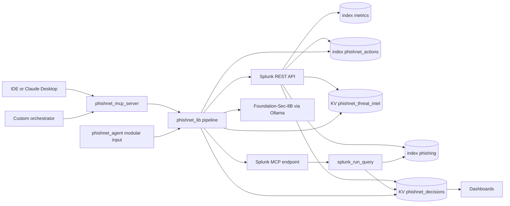
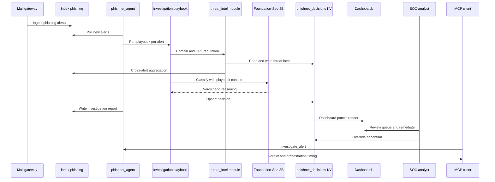

# PhishNet AI — Architecture Diagram

Documents how PhishNet AI interacts with Splunk, how AI agents and models are
integrated, and the data flow between components.

---

## System overview

PhishNet AI is a **Splunk Enterprise app** (`phishnet_ai`). All agent logic runs inside Splunk
as a Python modular input and alert action. Dashboards read from KV Store collections.
External AI clients connect via MCP (Model Context Protocol).



---

## How PhishNet AI interacts with Splunk

| Integration | Splunk mechanism | Purpose |
|---|---|---|
| **Alert ingest** | Reads `index=phishing` via `splunklib` search | Agent input queue |
| **Endpoint telemetry** | Reads `index=metrics` | Blast-radius CPU / network fusion |
| **Verdict persistence** | KV Store `phishnet_decisions` | Dashboards, drilldowns, audit state |
| **Reputation cache** | KV Store `phishnet_threat_intel` | Splunk-native domain/URL intel |
| **ROI metrics** | KV Store `phishnet_metrics` | Manager dashboard trends |
| **Investigation reports** | `index=phishnet_actions` | Searchable agent output |
| **Audit trail** | `index=phishnet_audit` + KV `phishnet_audit_log` | Analyst overrides / remediation |
| **Continuous processing** | Modular input (`inputs.conf`) | Scheduled agent runs |
| **Remediation** | Modular alert action (`alert_actions.conf`) | Analyst-approved response |
| **Dashboards** | Simple XML + `\| inputlookup` | Analyst and manager UI |
| **RBAC** | `authorize.conf` + `default.meta` | Analyst vs manager view access |
| **Optional search transport** | Official Splunk MCP Server `splunk_run_query` | Parallel orchestration searches |

---

## How AI models and agents are integrated

### 1. Autonomous investigation agent (primary)

The agent (`phishnet_lib.pipeline`) processes each alert through a **deterministic playbook**
 augmented by AI classification:

```
Alert (index=phishing)
    │
    ▼
┌───────────────────────────────────────────────────────────┐
│ Investigation playbook (investigation.py)                  │
│  • sender_reputation  → Splunk-native intel (threat_intel) │
│  • url_analysis       → Splunk-native intel                │
│  • recipient_scope    → alert + KV fields                  │
│  • click_through      → credential submission signals      │
│  • blast_radius       → metrics index fusion               │
└───────────────────────────────────────────────────────────┘
    │
    ▼
┌───────────────────────────────────────────────────────────┐
│ Classifier (classifier.py)                                 │
│  • mock        → deterministic heuristics (fast demo)      │
│  • dsdl        → Foundation-Sec-8B via Ollama              │
│  • huggingface → direct model fallback                     │
│  Output: verdict, confidence, reasoning, recommended_action│
└───────────────────────────────────────────────────────────┘
    │
    ▼
Persist → phishnet_decisions KV + index=phishnet_actions
```

**Foundation-Sec-8B** (Cisco Foundation AI security model) performs zero-shot phishing
classification. No custom training is required — the model receives alert context and
playbook findings and returns a structured verdict.

### 2. Splunk-native threat intelligence (no external APIs)

`phishnet_lib/threat_intel` computes reputation from **existing Splunk data**:

- Alert volume and recipient reach in `index=phishing`
- Prior agent verdicts in `phishnet_decisions`
- Cached in `phishnet_threat_intel` KV for dashboard and playbook use

### 3. Parallel MCP orchestration

When `investigate_alert` is called (via PhishNet MCP server or `agent_api`), a
**ThreadPoolExecutor** fans out five independent Splunk searches:

| Orchestrator tool | Data source |
|---|---|
| `sender_reputation` | `phishnet_threat_intel` KV |
| `message_trace` | `index=phishing` |
| `recipient_exposure` | `phishnet_decisions` KV |
| `user_interaction` | `phishnet_decisions` KV |
| `endpoint_blast_radius` | `phishnet_decisions` KV |

Searches route through **official Splunk MCP** (`splunk_run_query`) when enabled,
with **splunklib SDK fallback** per call.

### 4. PhishNet MCP server (agent exposed as tools)

`phishnet_mcp_server.py` (FastMCP, stdio transport) exposes:

| MCP tool | Agent capability |
|---|---|
| `list_alerts` | Queue listing |
| `triage_queue` | Full batch investigation |
| `investigate_alert` | Single-alert investigation + orchestration report |
| `get_blast_radius` | Security + observability fusion |

Any MCP-compatible client can drive the same pipeline that runs inside Splunk.

---

## Data flow (end to end)



---

## Component map

```
phishnet_ai/
├── bin/
│   ├── phishnet_agent.py          ← Splunk modular input entry point
│   ├── phishnet_remediate.py      ← Splunk alert action (remediation)
│   ├── phishnet_mcp_server.py     ← MCP server (stdio)
│   └── phishnet_lib/
│       ├── pipeline.py            ← Agent run loop
│       ├── investigation.py       ← Multi-step playbook
│       ├── classifier.py          ← Foundation-Sec-8B integration
│       ├── threat_intel/          ← Splunk-native reputation
│       ├── orchestrator.py        ← Parallel search fan-out
│       ├── splunk_mcp_client.py   ← Official Splunk MCP client
│       ├── splunk_io.py           ← SDK / file / MCP backends
│       └── agent_api.py           ← Stable API for MCP + tests
├── default/
│   ├── inputs.conf                ← Modular input configuration
│   ├── collections.conf           ← KV Store schemas
│   ├── authorize.conf             ← RBAC roles
│   └── data/ui/views/             ← Dashboard XML
└── metadata/default.meta          ← View ACLs (Manager ROI restricted)
```

---

## Security and human-in-the-loop

- Default mode **`recommend`**: agent suggests; analyst confirms.
- **`auto` mode**: auto-close only above configurable confidence threshold.
- All overrides and remediation actions write to **`index=phishnet_audit`** and **`phishnet_audit_log`** KV.
- **Manager ROI** view restricted to `phishnet_manager` role — analysts cannot access it.

---

## External dependencies

| Dependency | Role |
|---|---|
| Splunk Enterprise 9.x–10.x | Runtime platform |
| Splunk MCP Server ([Splunkbase #7931](https://splunkbase.splunk.com/app/7931)) | Optional `splunk_run_query` transport |
| Ollama + Foundation-Sec-8B GGUF | Optional live classification (`dsdl`) |
| Python 3.10+, `splunk-sdk`, `mcp` | Agent and MCP server |

---

## Demo video

https://youtu.be/PBy3xOAFcZo
